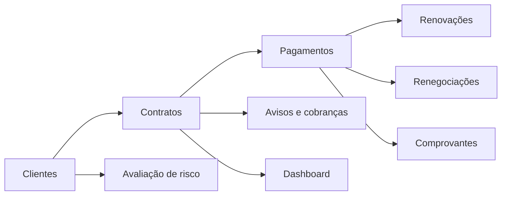

<div align="center">

# 💠 HelpSystemPro Crédito

### Gestão de crédito simples para operar. Poderosa para crescer.

Uma plataforma moderna para organizar clientes, contratos, pagamentos, renovações, cobranças e comprovantes — com histórico preservado e decisões claras.

[](#estado-atual)
[](#roadmap)
[](#demonstra%C3%A7%C3%A3o-local)
[](#seguran%C3%A7a-e-privacidade)

> **Visão do produto:** transformar uma operação real controlada em planilha em um sistema confiável, agradável e auditável, sem perder a história que originou o projeto.

</div>

---

## ✨ A proposta

O HelpSystemPro Crédito nasce de uma necessidade prática: acompanhar empréstimos de 30 dias sem depender de cálculos manuais e sem perder o histórico quando ocorre pagamento de juros, renovação ou renegociação.

Para o usuário, a rotina deve caber em poucas ações:

1. cadastrar o cliente;
2. abrir o empréstimo;
3. registrar o que foi recebido;
4. escolher entre quitar, amortizar, renovar ou renegociar;
5. confirmar o resumo calculado pelo sistema.

Por trás dessa simplicidade, o produto manterá lançamentos financeiros, vínculos entre contratos, comprovantes, auditoria, permissões e automações.

## 🖥️ O que esta primeira versão entrega

- dashboard executivo responsivo e apresentável;
- indicadores de principal, juros, saldo e vencimentos;
- lista de contratos que precisam de atenção;
- prévia das ações de pagamento, renovação e comprovante;
- saúde da carteira e atividade auditável;
- identidade visual premium e acessível em computador ou celular;
- documentação inicial do produto e das regras operacionais;
- dados exclusivamente demonstrativos — nenhum cliente real foi publicado.

> A interface atual é uma **demonstração funcional de experiência**. Os botões apresentam o comportamento planejado, mas ainda não persistem informações em banco de dados.

## 🧭 Regra principal de experiência

### Simples na frente, rigoroso por trás

Ao receber apenas os juros, por exemplo, o operador verá uma confirmação parecida com esta:

```text
Recebimento: R$ 300,00
Aplicação: juros do ciclo
Principal preservado: R$ 1.000,00
Novo vencimento: +30 dias
```

Ao confirmar, o sistema registra o pagamento, encerra o ciclo anterior, abre o próximo ciclo e liga os dois registros. Nenhum histórico é apagado.

## 🔄 Regras de negócio fundamentais

| Operação | O que acontece | Resultado esperado |
|---|---|---|
| Somente juros | O juro do ciclo é pago | Principal permanece e um novo ciclo de 30 dias é criado |
| Amortização parcial | Parte do pagamento reduz o principal | Próximo ciclo usa o principal remanescente |
| Quitação | Juros, encargos e principal são liquidados | Saldo zero e contrato encerrado |
| Renegociação | Um valor é recebido e o restante recebe novas condições | Contrato anterior é encerrado e vinculado ao novo |
| Comprovante enviado | Arquivo é associado ao pagamento | Fica pendente até conferência ou conciliação |

A especificação detalhada está em [`docs/REGRAS-DE-NEGOCIO.md`](docs/REGRAS-DE-NEGOCIO.md).

## 🧱 Módulos planejados



- **Clientes:** cadastro, documentos, consentimentos e histórico.
- **Contratos:** valores, taxa, prazo, vencimento e situação.
- **Pagamentos:** distribuição explícita entre multa, juros e principal.
- **Renovações:** ciclos vinculados sem apagar o contrato original.
- **Cobrança:** lembretes por WhatsApp, e-mail, SMS ou push.
- **Comprovantes:** anexos, recibos em PDF e código de validação.
- **Risco:** limite recomendado e políticas de concessão em uma fase futura.
- **Gestão:** relatórios, fluxo de caixa, auditoria e múltiplas empresas.

## 🚀 Demonstração local

### Requisitos

- Node.js 20 ou superior;
- npm 10 ou superior.

### Executar

```bash
npm install
npm run dev
```

Acesse o endereço mostrado no terminal, normalmente `http://localhost:5173`.

### Validar a compilação

```bash
npm run build
```

## 🗺️ Roadmap

| Etapa | Objetivo | Situação |
|---:|---|---|
| 1 | Visão do produto, regras e protótipo executivo | 🟢 Em andamento |
| 2 | Banco de dados, clientes, contratos e pagamentos | ⚪ Planejada |
| 3 | Renovação, renegociação e comprovantes | ⚪ Planejada |
| 4 | Avisos, cobrança e portal do cliente | ⚪ Planejada |
| 5 | Pix por parceiro autorizado e conciliação | ⚪ Planejada |
| 6 | Multiempresa, planos e administração SaaS | ⚪ Planejada |
| 7 | Avaliação de risco, garantias e seguros | ⚪ Futura |

Consulte [`docs/VISAO-DO-PRODUTO.md`](docs/VISAO-DO-PRODUTO.md) para o detalhamento.

## 🛡️ Segurança e privacidade

O produto será construído com privacidade desde a concepção:

- isolamento dos dados por empresa;
- autenticação em duas etapas;
- permissões por função;
- trilha de auditoria imutável;
- criptografia em trânsito e em repouso;
- backups testados;
- consentimentos e direitos do titular;
- política de retenção de dados;
- nenhuma senha ou documento pessoal no repositório.

O software será inicialmente posicionado como uma ferramenta de gestão. Integrações de pagamento, oferta de crédito, seguros e atividades reguladas dependerão de parceiros autorizados e validação jurídica específica.

## 🧰 Fundação técnica

O protótipo utiliza **React**, **TypeScript** e **Vite**. A arquitetura de produção será definida por etapas para evitar complexidade prematura, mas já está orientada a:

- aplicação web responsiva/PWA;
- API segura;
- banco relacional;
- armazenamento protegido de documentos;
- filas para notificações;
- eventos financeiros auditáveis;
- integrações desacopladas.

## 📚 Documentação

- [`Visão do produto`](docs/VISAO-DO-PRODUTO.md)
- [`Regras de negócio`](docs/REGRAS-DE-NEGOCIO.md)
- [`Arquitetura inicial`](docs/ARQUITETURA.md)
- [`Roadmap`](docs/ROADMAP.md)
- [`Roteiro para apresentação`](docs/APRESENTACAO.md)

## ✅ Qualidade automatizada

O núcleo financeiro inicial usa valores em **centavos inteiros**, evitando erros comuns de arredondamento com dinheiro. A suíte cobre cálculo de juros, distribuição de pagamentos, excedentes, renovação e datas.

```bash
npm run typecheck
npm test
npm run build
```

O GitHub Actions executa essas três verificações automaticamente em toda alteração enviada à `main` ou proposta por pull request.

### Atalho no Windows

Execute `INICIAR_PROTOTIPO.bat` para instalar o necessário na primeira utilização e abrir a demonstração no navegador.

---

<div align="center">

**HelpSystemPro Crédito**  
Tecnologia para transformar controle em confiança.

</div>
